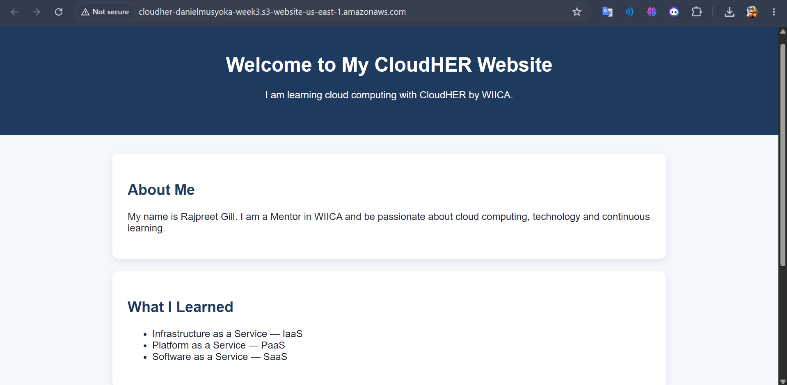

# CloudHER Personal Website

A responsive personal website built using **HTML5** and **CSS3**, version-controlled with **Git & GitHub**, and deployed using **Amazon S3 Static Website Hosting** as part of the **CloudHER by WIICA Week 3 Assignment**.

---

## Project Overview

This project demonstrates the fundamentals of cloud computing and static website hosting on AWS. The website introduces the learner, highlights key cloud computing concepts, and showcases the process of deploying a static website using Amazon S3.

The project was developed as part of the CloudHER by WIICA mentorship program to provide hands-on experience with:

* Web development using HTML and CSS
* Version control using Git
* Source code management using GitHub
* Cloud storage and hosting using Amazon S3
* Static website deployment

---

## Technologies Used

* HTML5
* CSS3
* Git
* GitHub
* Amazon Web Services (AWS)
* Amazon S3 Static Website Hosting

---

## Project Structure

```text
cloudher-personal-website/
│
├── index.html
├── style.css
├── README.md
├── .gitignore
└── screenshots/
    ├── homepage.png
    └── s3-bucket.png
```

---


## AWS S3 Deployment

### Bucket Name

```text
cloudher-danielmusyoka-week3
```

### Deployment Steps

1. Created an Amazon S3 bucket.
2. Uploaded the website files (`index.html` and `style.css`).
3. Disabled Block Public Access.
4. Configured a bucket policy for public read access.
5. Enabled Static Website Hosting.
6. Tested the website using the generated S3 Website Endpoint.

---

## Live Website

**Website URL:**

```text
http://cloudher-danielmusyoka-week3.s3-website-us-east-1.amazonaws.com
```
---

## Screenshots

### Website Homepage



### S3 Bucket Configuration


---

## Learning Outcomes

Through this project, I gained practical experience in:

* Building static websites using HTML and CSS
* Working with Git version control
* Managing repositories on GitHub
* Deploying websites on AWS S3
* Configuring bucket permissions and policies
* Understanding cloud-based hosting solutions

---


## Author

**Daniel Nzioki Musyoka**

* GitHub: https://github.com/Daniel059
* LinkedIn: https://www.linkedin.com/in/daniel-nzioki-musyoka

---

## Acknowledgements

This project was completed as part of the **CloudHER by WIICA Week 3 Cloud Computing Assignment**, which focuses on introducing learners to cloud technologies and practical AWS deployment skills.

Special thanks to my mentor **Rajpreet Gill** for her guidance and support throughout my CloudHER journey. Her mentorship helped me deepen my understanding of **AWS and  Cloud Computing**, and gave me valuable insights into building and deploying cloud-based solutions.

🔗 LinkedIn: https://www.linkedin.com/company/wiica/

🔗 LinkedIn: https://www.linkedin.com/in/rajpreet-gill-devop/

---

## License

This project is for educational and learning purposes.
